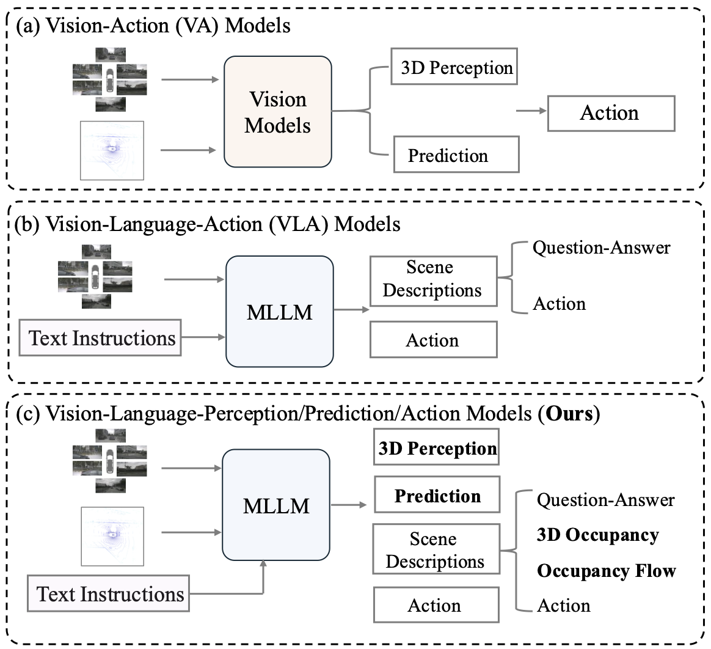
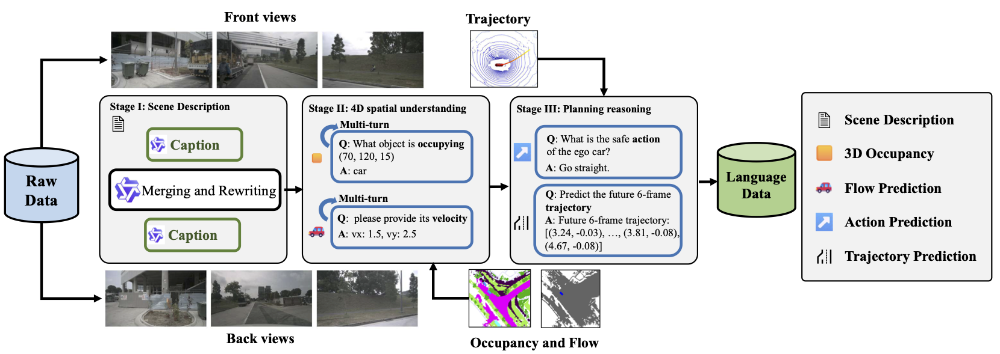
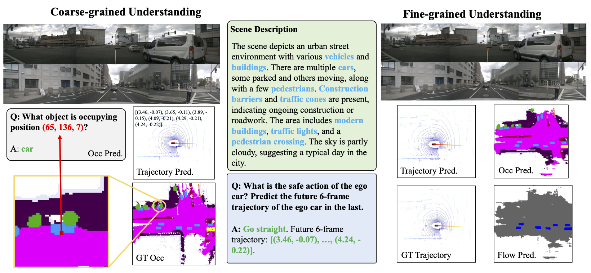

<div align="center">

### DrivePI: Spatial-aware 4D MLLM for Unified Autonomous Driving Understanding, Perception, Prediction and Planning

[Zhe Liu](https://github.com/happinesslz)<sup>1</sup>,
[Runhui Huang](https://scholar.google.com/citations?user=B5zcj4wAAAAJ)<sup>1</sup>,
[Rui Yang](https://scholar.google.com/citations?user=Bi7e6bIAAAAJ&hl=zh-CN)<sup>1</sup>,
[Siming Yan](https://scholar.google.com/citations?user=znWC2vAAAAAJ&hl=en)<sup>2</sup>,
[Zining Wang](https://cn.linkedin.com/in/wangzining12)<sup>2</sup>,
[Lu Hou](https://houlu369.github.io)<sup>2</sup>,
[Di Lin](https://dilincv.github.io)<sup>3</sup>,
[Xiang Bai](https://xbai.vlrlab.net)<sup>4</sup>,
[Hengshuang Zhao](https://i.cs.hku.hk/~hszhao)<sup>1,✉</sup>
<br>
<sup>1</sup> The University of Hong Kong,
<sup>2</sup> Yinwang Intelligent Technology Co. Ltd.,
<sup>3</sup> Tianjin University,
<sup>4</sup> Huazhong University of Science and Technology
<br>
✉ Corresponding author.
<br>

<!-- [](https://arxiv.org/abs/placeholder)
[](https://github.com/happinesslz/DrivePI)
[](https://github.com/happinesslz/DrivePI)
[](https://placeholder-dataset-link.com) -->


</div>

## 🔥 Highlights

* **Unified Spatial-aware 4D MLLM Framework**. DrivePI is the first unified framework that seamlessly integrates coarse-grained linguistic spatial understanding with fine-grained 3D perception capabilities, bridging the gap between vision-action (VA) and vision-language-action (VLA) paradigms in autonomous driving. 💪

* **Multi-modal Sensing**. DrivePI incorporates LiDAR as a complementary sensing modality alongside camera imagery, providing high-precision 3D geometric information that better elicits the spatial understanding capabilities of MLLMs. 💪

* **Fine-grained 3D Perception and Prediction**. DrivePI enables accurate 3D perception (e.g., 3D occupancy) and prediction (e.g., occupancy flow), which effectively enhances the interpretability and safety assurances for autonomous driving systems. 💪

* **Strong Performance**. Despite utilizing only a compact 0.5B parameter MLLM backbone (Qwen2.5), DrivePI outperforms existing VA models in 3D occupancy and occupancy flow while maintaining comparable interactive capabilities with existing VLA frameworks. 💪

## News
* **2025.12.15**: DrivePI paper released. 🔥
* **2025.11.04**: Our previous work [UniLION](https://github.com/happinesslz/UniLION) has been released. Check out the [codebase](https://github.com/happinesslz/UniLION) for unified autonomous driving model with Linear Group RNNs. 🚀
* **2024.09.26**: Our work [LION](https://github.com/happinesslz/LION) has been accepted by NeurIPS 2024. Visit the [codebase](https://github.com/happinesslz/LION) for Linear Group RNN for 3D Object Detection. 🚀


## TODO
- [x] Release the paper.
- [ ] Release checkpoints of DrivePI.
- [ ] Release all code of DrivePI.
- [ ] Release the dataset.


## 🚗 Overview

<div style="display: flex; align-items: center;">
<div style="flex: 1; padding-right: 20px;">
In end-to-end autonomous driving systems, two main approaches have emerged:
<ul>
<li><strong>Vision-Action (VA) models</strong> take visual information (LiDAR point clouds, images) as inputs and output action signals through a modular framework. While these methods achieve promising results through <em>accurate spatial perception</em>, they are limited in language-based scene interaction.</li>
<li><strong>Vision-Language-Action (VLA) approaches</strong> leverage the reasoning capabilities of multimodal large language models (MLLMs). These methods achieve <em>superior interaction capabilities</em> but often struggle due to the <strong>absence of fine-grained intermediate 3D perception and prediction</strong>.</li>
</ul>

DrivePI bridges this gap by combining the strengths of both approaches, serving as a unified Vision-Language-Action framework that is also compatible with vision-action models. Our method jointly performs spatial understanding, 3D perception (i.e., 3D occupancy), prediction (i.e., occupancy flow), and planning (i.e., action outputs) in parallel through end-to-end optimization. To obtain both precise geometric information and rich visual appearance, our approach integrates point clouds, multi-view images, and language instructions within a unified MLLM architecture.

<div align="center">

</div>


## 📊 Data Engine

<div align="center">

</div>

Our multi-stage data pipeline consists of:

1. **Caption Annotation**: We use InternVL3-78B to generate captions of front and back views separately, then merge and polish them to create comprehensive scene descriptions.
2. **4D Spatial Understanding Annotation**: We leverage ground-truth occupancy and flow data to generate diverse text-occupancy and text-flow QA pairs through multi-turn conversations, enabling fine-grained 3D understanding.
3. **Planning Reasoning Annotation**: We create planning QA pairs based on future trajectory annotations to enhance planning interpretability, enabling the MLLM to predict future actions of the ego-vehicle.

## 📈 Results

Remarkably, with only a 0.5B Qwen2.5 model as MLLM backbone, DrivePI as a single unified model matches or exceeds both existing VLA models and specialized VA models:

- Compared to VLA models, DrivePI outperforms OpenDriveVLA-7B by 2.5% mean accuracy on nuScenes-QA and reduces collision rate by 70% over ORION (from 0.37% to 0.11%) on nuScenes.
- Against specialized VA models, DrivePI surpasses FB-OCC by 10.3 RayIoU for 3D occupancy on OpenOcc, reduces the mAVE from 0.591 to 0.509 for occupancy flow on OpenOcc, and achieves 32% lower L2 error than VAD (from 0.72m to 0.49m) for planning on nuScenes.

<div align="center">

<p><em>Visualization of DrivePI's multi-granularity understanding capabilities</em></p>
</div>

### 3D Occupancy and Occupancy Flow on OpenOcc

| Method | VLM-based | OccScore | RayIoU<br>(3D Occ.) | mAVE<br>(Occ. Flow) | RayIoU$_{\mathrm{1m}}$ | RayIoU$_{\mathrm{2m}}$ | RayIoU$_{\mathrm{4m}}$ |
|--------|:---------:|:--------:|:-------------------:|:-------------------:|:----------------------:|:----------------------:|:----------------------:|
| OccNeRF | | 28.5 | 31.7 | -- | 16.6 | 29.3 | 49.2 |
| RenderOcc | | 33.0 | 36.7 | -- | 20.3 | 32.7 | 49.9 |
| LetOccFlow | | 36.4 | 40.5 | -- | 25.5 | 39.7 | 56.3 |
| OccNet | | 35.7 | 39.7 | -- | 29.3 | 39.7 | 50.0 |
| BEVDetOcc-SF | | 33.0 | 36.7 | 1.420 | 31.6 | 37.3 | 41.1 |
| FB-Occ | | 39.2 | 39.0 | 0.591 | 32.7 | 39.9 | 44.4 |
| F-Occ | | 41.0 | 39.9 | 0.491 | 33.9 | 40.7 | 45.2 |
| CascadeFlow | | 40.9 | 39.6 | 0.470 | 33.5 | 40.3 | 45.0 |
| ALOcc-Flow-3D | | 43.0 | 41.9 | 0.556 | 35.6 | 42.8 | 47.4 |
| **DrivePI (Ours)** | ✓ | **49.3** | **49.3** | **0.509** | **45.0** | **50.0** | **52.9** |

### 3D Occupancy on Occ3D-nuScenes

| Method | VLM-based | RayIoU | RayIoU$_{\mathrm{1m}}$ | RayIoU$_{\mathrm{2m}}$ | RayIoU$_{\mathrm{4m}}$ |
|--------|:---------:|:------:|:----------------------:|:----------------------:|:----------------------:|
| RenderOcc | | 19.5 | 13.4 | 19.6 | 25.5 |
| SimpleOcc | | 22.5 | 17.0 | 22.7 | 27.9 |
| BEVFormer | | 32.4 | 26.1 | 32.9 | 38.0 |
| BEVDet-Occ | | 32.6 | 26.6 | 33.1 | 38.2 |
| FB-Occ | | 33.5 | 26.7 | 34.1 | 39.7 |
| SparseOcc | | 36.1 | 30.2 | 36.8 | 41.2 |
| OPUS | | 41.2 | 34.7 | 42.1 | 46.7 |
| **DrivePI* (Ours)** | ✓ | **46.0** | **42.2** | **46.7** | **49.2** |

*DrivePI trained exclusively on the 3D occupancy task of Occ3D-nuScenes.

### Planning on nuScenes

| Method | VLM-based | Ego Status | L2 (m) |  | | | Collision Rate (%) | | | |
|--------|:---------:|:----------:|:------:|:------:|:------:|:------:|:----------------:|:----------------:|:----------------:|:----------------:|
| | | | 1s | 2s | 3s | avg. | 1s | 2s | 3s | avg. |
| ST-P3 | | | 1.33 | 2.11 | 2.90 | 2.11 | 0.23 | 0.62 | 1.27 | 0.71 |
| FF | | | 0.55 | 1.20 | 2.54 | 1.43 | 0.06 | 0.17 | 1.07 | 0.43 |
| EO | | | 0.67 | 1.36 | 2.78 | 1.60 | 0.04 | 0.09 | 0.88 | 0.33 |
| UniAD | | | 0.48 | 0.96 | 1.65 | 1.03 | 0.05 | 0.17 | 0.71 | 0.31 |
| VAD | | | 0.41 | 0.70 | 1.05 | 0.72 | 0.07 | 0.17 | 0.41 | 0.22 |
| VAD | | ✓ | 0.17 | 0.34 | 0.60 | 0.37 | 0.07 | 0.10 | 0.24 | 0.14 |
| OmniDrive | ✓ | ✓ | 0.14 | 0.29 | 0.55 | 0.33 | 0.00 | 0.13 | 0.78 | 0.30 |
| ORION | ✓ | ✓ | 0.17 | 0.31 | 0.55 | 0.34 | 0.05 | 0.25 | 0.80 | 0.37 |
| OpenDriveVLA-7B | ✓ | ✓ | 0.20 | 0.58 | 1.21 | 0.66 | 0.00 | 0.22 | 0.55 | 0.25 |
| **DrivePI (Ours)** | ✓ | | **0.24** | **0.46** | **0.78** | **0.49** | **0.38** | **0.27** | **0.48** | **0.38** |
| **DrivePI (Ours)** | ✓ | ✓ | **0.19** | **0.36** | **0.64** | **0.40** | **0.00** | **0.05** | **0.28** | **0.11** |

### Text Understanding on nuScenes-QA

| Method | Exist | Count | Object | Status | Comparison | Accuracy |
|--------|:-----:|:-----:|:------:|:------:|:----------:|:--------:|
| LLaMA-AdapV2 | 19.3 | 2.7 | 7.6 | 10.8 | 1.6 | 9.6 |
| LLaVA1.5 | 45.8 | 7.7 | 7.8 | 9.0 | 52.1 | 26.2 |
| LiDAR-LLM | 74.5 | 15.0 | 37.8 | 45.9 | 57.8 | 48.6 |
| BEVDet+BUTD | 83.7 | 20.9 | 48.8 | 52.0 | 67.7 | 57.0 |
| OpenDriveVLA-0.5B | 83.9 | 22.0 | 50.2 | 57.0 | 68.4 | 58.4 |
| OpenDriveVLA-3B | 84.0 | 22.3 | 50.3 | 56.9 | 68.5 | 58.5 |
| OpenDriveVLA-7B | 84.2 | **22.7** | 49.6 | 54.5 | **68.8** | 58.2 |
| **DrivePI (Ours)** | **85.3** | 22.4 | **57.5** | **59.1** | 68.3 | **60.7** |

### Component Ablation Study

| # | Text Head | Vision Head | 3D Occ.<br>RayIoU | Occ. Flow<br>mAVE | Planning |  | QA<br>Acc. |
|:-:|:---------:|:----------:|:-----------------:|:-----------------:|:-------:|:-------:|:--------:|
| | | | | | L2 | Col. | |
| I | ✓ | -- | -- | -- | -- | -- | **61.2** |
| II | -- | ✓ | 47.5 | 0.69 | 1.02 | 0.39 | -- |
| III | ✓ | ✓ | **49.3** | **0.51** | **0.49** | **0.38** | 60.7 |

## 📝 Citation

```bibtex
@article{liu2025drivepi,
  title={DrivePI: Spatial-aware 4D MLLM for Unified Autonomous Driving Understanding, Perception, Prediction and Planning},
  author={Liu, Zhe and Huang, Runhui and Yang, Rui and Yan, Siming and Wang, Zining and Hou, Lu and Lin, Di and Bai, Xiang and Zhao, Hengshuang},
  journal={arXiv preprint},
  year={2025}
}
```

## Acknowledgements
We thank these great works and open-source repositories: [UniLION](https://github.com/happinesslz/UniLION), [MMDectection3D](https://github.com/open-mmlab/mmdetection3d), [InternVL3](https://github.com/OpenGVLab/InternVL), [LLaVA](https://github.com/haotian-liu/LLaVA), and [EMOVA](https://github.com/emova-ollm/EMOVA).